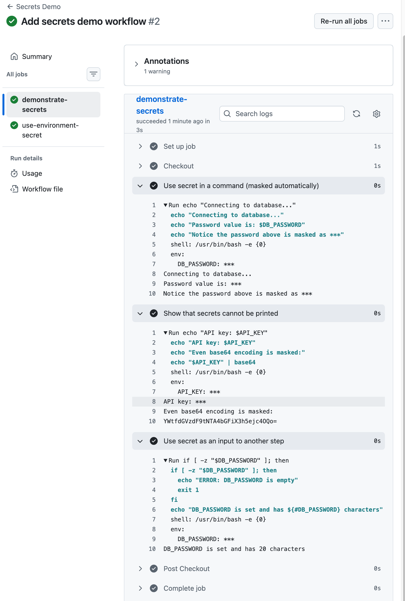
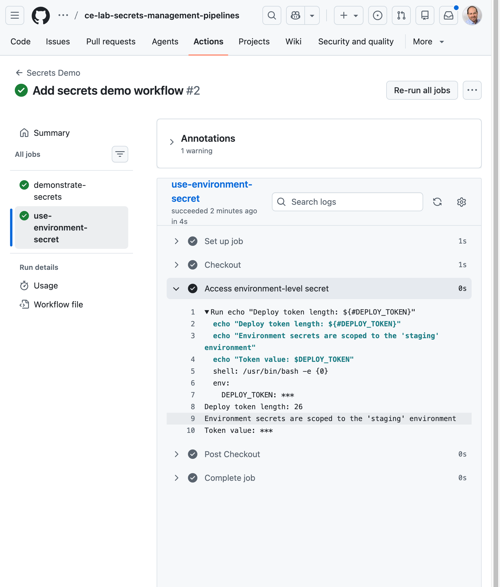
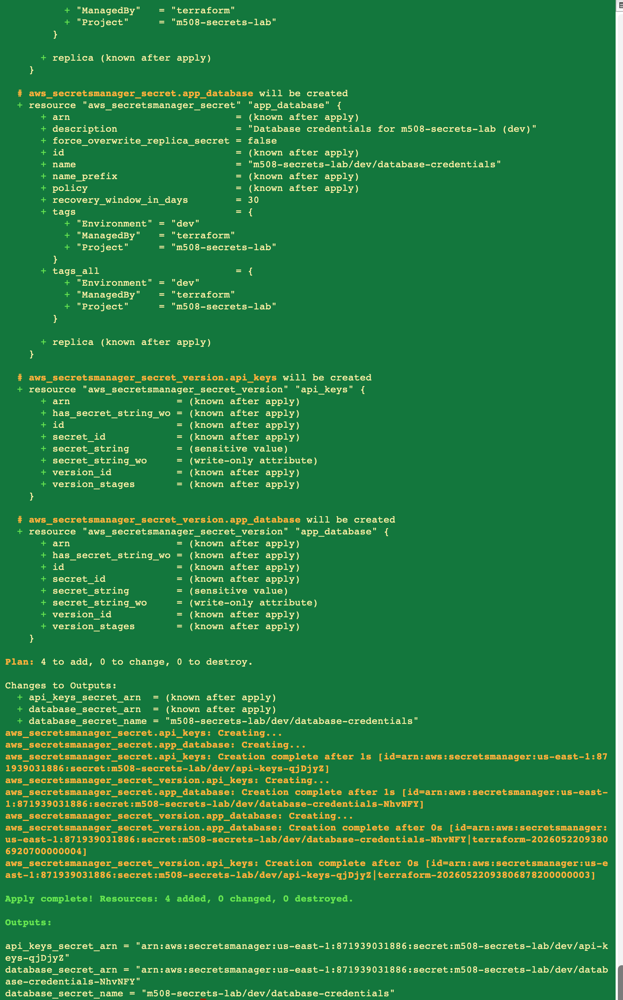
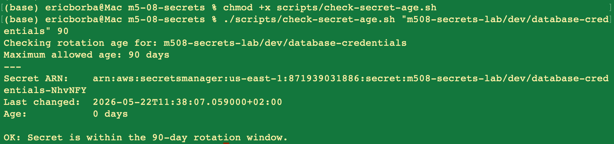
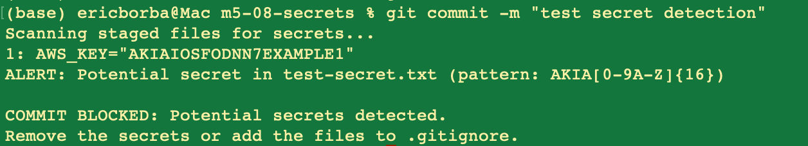
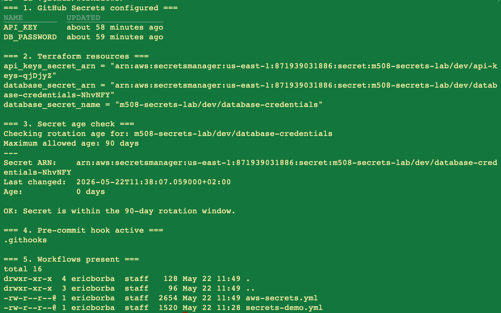

# Lab M5.08 - Secrets Management in Pipelines

## What This Project Does

Demonstrates secure secrets handling across GitHub Actions and AWS Secrets Manager. Includes log masking, rotation-age checks, Terraform-provisioned secrets, and a pre-commit hook that blocks accidentally committed credentials.

## Project Structure

```
.
├── .github/workflows/
│   ├── secrets-demo.yml        # GitHub Secrets masking demo
│   └── aws-secrets.yml         # AWS Secrets Manager retrieval + rotation check
├── terraform/
│   ├── main.tf                 # Secrets Manager resources
│   ├── variables.tf
│   └── outputs.tf
├── scripts/
│   ├── check-secret-age.sh     # Rotation age checker
│   └── scan-secrets.sh         # Secret pattern scanner (used by pre-commit hook)
├── .githooks/
│   └── pre-commit              # Pre-commit secret scan
├── .pre-commit-config.yaml
└── .gitignore
```

## Secrets Configured

| Scope | Name | Purpose |
|---|---|---|
| GitHub Repository | `DB_PASSWORD` | Simulated database password |
| GitHub Repository | `API_KEY` | Simulated third-party API key |
| GitHub Environment (`staging`) | `DEPLOY_TOKEN` | Environment-scoped deploy token |
| AWS Secrets Manager | `m508-secrets-lab/dev/database-credentials` | DB host, user, password, port, name |
| AWS Secrets Manager | `m508-secrets-lab/dev/api-keys` | Stripe and SendGrid placeholder keys |

## How to Run

### Deploy AWS Secrets Manager resources

```bash
cd terraform
terraform init
terraform validate
terraform plan
terraform apply -auto-approve
cd ..
```

### Run the secret rotation age check

```bash
./scripts/check-secret-age.sh "m508-secrets-lab/dev/database-credentials" 90
./scripts/check-secret-age.sh "m508-secrets-lab/dev/api-keys" 90
```

### Enable the pre-commit hook

```bash
git config core.hooksPath .githooks
```

### Verify all components

```bash
echo "=== 1. GitHub Secrets ===" && gh secret list
echo "=== 2. Terraform outputs ===" && cd terraform && terraform output && cd ..
echo "=== 3. Secret age check ===" && ./scripts/check-secret-age.sh "m508-secrets-lab/dev/database-credentials" 90
echo "=== 4. Hook active ===" && git config core.hooksPath
echo "=== 5. Workflows ===" && ls .github/workflows/
```

## Key Decisions

- **`::add-mask::`** is used for dynamically retrieved secrets from AWS Secrets Manager, since GitHub only masks values stored as GitHub Secrets automatically — values fetched at runtime must be masked explicitly.
- **Terraform** manages all AWS Secrets Manager resources for auditability and reproducibility.
- **Pre-commit hook** uses PCRE-compatible regex patterns (via `perl`) matching common credential formats (AWS keys, GitHub tokens, Stripe keys, private keys, hardcoded passwords).
- **`perl -ne`** replaces `grep -P` in the scan script to ensure compatibility on macOS, where BSD grep does not support the `-P` flag and silently ignores it.

## Screenshots

### 1. GitHub Secrets — `demonstrate-secrets` job: DB_PASSWORD and API_KEY masked as `***`


### 2. GitHub Secrets — `use-environment-secret` job: DEPLOY_TOKEN masked as `***` in the staging environment


### 3. Terraform apply: two AWS Secrets Manager secrets created (database-credentials and api-keys)


### 4. Secret rotation age check: database-credentials is 0 days old, within the 90-day window


### 5. Pre-commit hook: commit blocked after detecting a fake AWS access key in `test-secret.txt`


### 6. End-to-end verification: all five checks passing (secrets, Terraform, rotation, hook, workflows)

